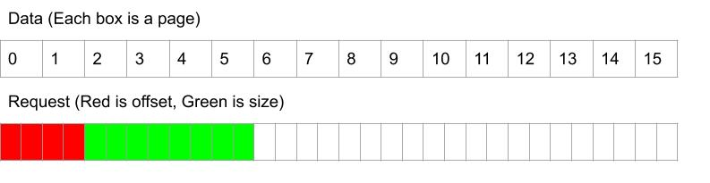
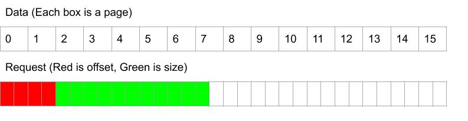
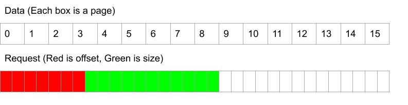
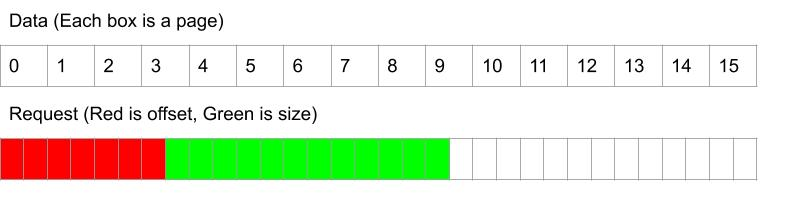

# Basic EEPROM Read/Write #


## How to run ##

1. Edit `test.txt` with whatever dummy values
2. `make`
3. `./eeprommake`

Note: `make` copies the content from `backup_test.txt` to `test.txt` to restore back to original content. This is to make things less confusing when doing `eeprom_write`.

## Folder structure ##
```
eeprom
|   README.md
|   test.txt
|   backup_test.txt
|   Makefile
|
|———src
|   |   eeprom.c
|   |   ll_func.c
|   |   eeprom_main.c
|
|———include
|   |   eeprom.h
|   |   ll_func.h
|   |   eeprom_main.h
|
|———etc
|   |   Case_1.jpg
|   |   Case_2.jpg
|   |   Case_3.jpg
|   |   Case_4.jpg

```

## List of assumptions I made ##
- `offset` and `size` variables are in bytes


## Code explained ##
`src/eeprom.c` contains the main functionalities of EEPROM given by the prompt.
`src/ll_func.c` contsins the low level functions mimicked by File IO functions.

### eeprom_read ###
`int eeprom_read(uint32_t offset, int size, char *buf)`

First, this function checks for any invalid inputs. Invalid inputs can mean the following:
- `offset` is greater than size of EEPROM
- `size` is negative or zero
- `offset`+`size` is greater than the size of EEPROM, 8192 bytes.

The first case inadvertently checks whether `offset` is negative as well. If the user passes a negative number into the parameter, it will be converted to its unsigned value, which is most starts from `UINT_MAX`, a number far greater than size of EEPROM, 8192 bytes.

Then, it performs necessary reads. The reads are categorized into 4 different cases:
1. `offset` and `size` are both multiples of `PAGE_SIZE`, which is 32 bytes
2. `offset` is a multiple of `PAGE_SIZE`, but size is not
3. `offset` and `size` are both not multiples of `PAGE_SIZE`, but offset+size is a multiple of `PAGE_SIZE`
4. `offset` and `size` are both not multiples of `PAGE_SIZE` AND offset+size is NOT a multiple of `PAGE_SIZE`

The function returns 0 for successful read, -1 for wrong `offset`, -2 for nonpositive `size`, -3 for index out of bound.

__Case #1__



This is the simplest and the most ideal case. Because `offset` ends where the page ends, I can start reading n number of page reads, where n is the number of pages in `size`.


__Case #2__



The only difference between this case and __Case #1__ is that after I read n number of page reads, there are still m bytes of data to be read, where m is `size%PAGE_SIZE`. 
To read only m bytes of data, I first read the entire page where we left off, and copy only the first m bytes into my buffer using `memcpy` function.


__Case #3__



First, I read the page that has portion of the `size`. In above example, I would read page 3. Then, I copy only the latter parts of page 3.
At this point, my buffer will point to somewhere between page 3 and page 4. The number of page reads I do will be determined by the total number of aligned pages in `size`, which would be 5 in this case (4~8). The pointer to my buf will be offset by the amount of bytes I copied earlier; in the above example, it would be offset by 16 bytes.


__Case #4__



This case is the combination of __Case #2__ and __Case #3__.

### Testing eeprom_read ###
In `src/eeprom_main.c`, `eeprom_read_test()` function tests the behaviors of `eeprom_read`. It first checks for all 4 cases, followed by invalid inputs.


### eeprom_write ###
`int eeprom_write(uint32_t offset, int size, char *buf)`

This function works very similar to `eeprom_read`. It checks for the invalid inputs in a similar way. One difference in invalid input is if the size of input buffer is different than the size of `size`. 
Additional differences are for places where I write number of bytes that are smaller than 32.
For example, in `eeprom_read`, under __Case #2__, I had the following:
```
    // Reading the remaining bytes
    ll_read((i+offset/PAGE_SIZE)*PAGE_SIZE, temp);    // Reading entire page
    memcpy(buf + i*PAGE_SIZE, temp, size%PAGE_SIZE);  // Storing only desired bytes from the page
    memset(temp, 0, PAGE_SIZE-1);    // Clear temp array
```

However, in `eeprom_write`, I need to do the following:
1. Read the entire page into a temp array using `eeprom_read`
2. Only modify the portion of the temp array. It may be first couple of bytes or last couple of bytes depending on which case I am in.
3. Write back the temp array with the updated bytes.

The code will then turn into the following:
```
    // Writing the remaining bytes
    ll_read((i+offset/PAGE_SIZE)*PAGE_SIZE, temp);      // Read entire page to temp
    memcpy(temp, buf + i*PAGE_SIZE, size%PAGE_SIZE);    // Overwriting portion of temp with remaining bytes
    ll_write((i+offset/PAGE_SIZE)*PAGE_SIZE, temp);     // Copy the updated page back
    memset(temp, 0, PAGE_SIZE-1);    // Clear temp array
```

The similar change is made for __Case #3__ and __Case #4__.

### Testing eeprom_write ###
In `src/eeprom_main.c`, `eeprom_write_test()` function tests the behaviors of `eeprom_write`. It first checks for all 4 cases, followed by invalid inputs.
The string to be written is defined by me. To test each cases, I used `memcpy` to get desired number of bytes. To check whether the functions work, I can manually check test.txt to see if the desired positions have been updated, but leaving other locations intact.

### eeprom_reset ###
`void eeprom_reset()`

This function is meant to reset the EEPROM. It calls a lowlevel reset function, which resets the EEPROM by slightly raising the voltage above normal "HIGH" level. I did not implement this function as this would be a bit outside the scope of the prompt.

### Using mutexes to limit concurrent hardware access ###
Because this code must mimic EEPROM behavior, I needed to incorporate the case of multiple consumers trying to access the resource. To limit the access to the hardware while an operation is ongoing, I used mutexes. As soon as `eeprom_read()` or `eeprom_write()` function would start, it would lock a global, common(between read/write) mutex so another consumer cannot access it. It then unlocks the mutex right before the function exits, either via a successful read/write or via an error. My code has common mutex, meaning while consumer A is reading OR writing, consumer B can do neither operation.

### Testing concurrent hardware access ###
To test the concurrent access, I utilized multithreading. First I created two threads that does the same thing: read from one place and write to another place. Then, using print statements right before and right after the functions, I observed the behavior. Below is an example of the test:

```
----Starting mutex test----
Thread 1 read #0 start.
Thread 0 read #0 start.
Thread 1 read #0 end.
Thread 1 write #0 start.
Thread 1 write #0 end.
Thread 1 read #1 start.
Thread 1 read #1 end.
Thread 1 write #1 start.
Thread 0 read #0 end.
Thread 0 write #0 start.
Thread 0 write #0 end.
Thread 0 read #1 start.
Thread 0 read #1 end.
Thread 0 write #1 start.
Thread 0 write #1 end.
Thread 0 read #2 start.
Thread 0 read #2 end.
Thread 0 write #2 start.
Thread 0 write #2 end.
Thread 0 read #3 start.
Thread 0 read #3 end.
Thread 0 write #3 start.
Thread 0 write #3 end.
Thread 0 read #4 start.
Thread 0 read #4 end.
Thread 0 write #4 start.
Thread 0 write #4 end.
Thread 1 write #1 end.
Thread 1 read #2 start.
Thread 0 read #5 start.
Thread 1 read #2 end.
Thread 1 write #2 start.
Thread 1 write #2 end.
Thread 1 read #3 start.
Thread 0 read #5 end.
Thread 0 write #5 start.
Thread 0 write #5 end.
Thread 0 read #6 start.
Thread 0 read #6 end.
Thread 0 write #6 start.
Thread 0 write #6 end.
Thread 0 read #7 start.
Thread 0 read #7 end.
```

As seen in the console result, once thread 0 is doing an operation, the thread 1 can start the operation but cannot finish the operation until thread 0 finishes the operation. Also, when a read operation is ongoing, write operation cannot begin, and vice versa.

### Mimicking low-level functions ###

I used File IO from `<stdio.h>` to mimic the low-level function behaviors. 

`ll_read(uint32_t offset, char *buf)`
I first open the `test.txt` file as read access. Then, I move the pointer to the offset determined by the parameter using `fseek` function. I then read 32 characters. I decided to use `fgetc` function rather than `fgets` function as `fgets` puts a NULL character `\0` at the end of the buffer, which is NOT what I want, because I plan to call the `ll_read` function multiple times in my `eeprom_read` function.


`ll_write(uint32_t offset, char *buf)`
I open the `test.txt` file as read/write access. It also uses `fseek` function in a similar way as `ll_read`. It uses `fputc` to put each byte into the file.


`ll_eeprom_reset()`
This is where an EEPROM reset function would be present.


## Couple thought process I want to highlight ##
- The length of my function is quite long. I could have combined all cases into one giant block of code that checks for `offset` and `size` as I go. However, I steered away from this method as it would have made my code less "modular" and more confusing to look at.
- For `eeprom_write_test()`, I could have used `eeprom_read` function to check whether my writes have been successful. But I decided not to use it, because it felt like testing my code using my other code seemed counterintuitive. I resorted to checking the `test.txt` file manually by highlighting the text and checking its location.
- For `eeprom_read`, size of input buffer does not necessarily matter as it will be given by the user. Rather than storing the read values into a buf, the user can have it constantly written out on a console. I just used a read buffer of size 256 for easy testing purposes. When I tried using read buffer of size less than the `size` parameter, I got a "Stack smashing error", which is what I expected. For `eeprom_write`, however, the size of input buf matters a lot. If the size of input buf is larger than `size` parameter, only `size` number of bytes from input buf will be updated, which is what the user might not have intended. To remedy this, I just decided to throw out an error if the size of input buf is not same as `size`. I thought this was the best way of letting the user know. 
  - To get the size of input parameter, I used the `strlen` function, which might not be the best option in the real world as EEPROM data does not have any '\0' byte to help indicate the size. For a real world scenario, I would have resorted to different way of determining the size. One idea is to continuously read the input buf until I hit a `0xFF` value, which I know means "reset state."
- I could have used bit-shifting rather than memcpy to make my functions more efficient (This is for Case #2~4).


